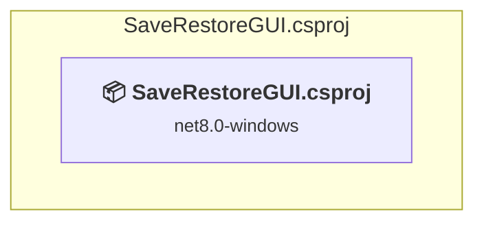

# Projects and dependencies analysis

This document provides a comprehensive overview of the projects and their dependencies in the context of upgrading to .NETCoreApp,Version=v10.0.

## Table of Contents

- [Executive Summary](#executive-Summary)
  - [Highlevel Metrics](#highlevel-metrics)
  - [Projects Compatibility](#projects-compatibility)
  - [Package Compatibility](#package-compatibility)
  - [API Compatibility](#api-compatibility)
- [Aggregate NuGet packages details](#aggregate-nuget-packages-details)
- [Top API Migration Challenges](#top-api-migration-challenges)
  - [Technologies and Features](#technologies-and-features)
  - [Most Frequent API Issues](#most-frequent-api-issues)
- [Projects Relationship Graph](#projects-relationship-graph)
- [Project Details](#project-details)

  - [SaveRestoreGUI.csproj](#saverestoreguicsproj)

## Executive Summary

### Highlevel Metrics

| Metric | Count | Status |
| :--- | :---: | :--- |
| Total Projects | 1 | All require upgrade |
| Total NuGet Packages | 1 | All packages need upgrade |
| Total Code Files | 3 |  |
| Total Code Files with Incidents | 5 |  |
| Total Lines of Code | 2364 |  |
| Total Number of Issues | 2402 |  |
| Estimated LOC to modify | 2400+ | at least 101,5% of codebase |

### Projects Compatibility

| Project | Target Framework | Difficulty | Package Issues | API Issues | Est. LOC Impact | Description |
| :--- | :---: | :---: | :---: | :---: | :---: | :--- |
| [SaveRestoreGUI.csproj](#saverestoreguicsproj) | net8.0-windows | 🟡 Medium | 1 | 2400 | 2400+ | WinForms, Sdk Style = True |

### Package Compatibility

| Status | Count | Percentage |
| :--- | :---: | :---: |
| ✅ Compatible | 0 | 0,0% |
| ⚠️ Incompatible | 0 | 0,0% |
| 🔄 Upgrade Recommended | 1 | 100,0% |
| ***Total NuGet Packages*** | ***1*** | ***100%*** |

### API Compatibility

| Category | Count | Impact |
| :--- | :---: | :--- |
| 🔴 Binary Incompatible | 2186 | High - Require code changes |
| 🟡 Source Incompatible | 214 | Medium - Needs re-compilation and potential conflicting API error fixing |
| 🔵 Behavioral change | 0 | Low - Behavioral changes that may require testing at runtime |
| ✅ Compatible | 2589 |  |
| ***Total APIs Analyzed*** | ***4989*** |  |

## Aggregate NuGet packages details

| Package | Current Version | Suggested Version | Projects | Description |
| :--- | :---: | :---: | :--- | :--- |
| System.Management | 8.0.0 | 10.0.9 | [SaveRestoreGUI.csproj](#saverestoreguicsproj) | La mise à niveau du package NuGet est recommandée |

## Top API Migration Challenges

### Technologies and Features

| Technology | Issues | Percentage | Migration Path |
| :--- | :---: | :---: | :--- |
| Windows Forms | 2186 | 91,1% | Windows Forms APIs for building Windows desktop applications with traditional Forms-based UI that are available in .NET on Windows. Enable Windows Desktop support: Option 1 (Recommended): Target net9.0-windows; Option 2: Add <UseWindowsDesktop>true</UseWindowsDesktop>; Option 3 (Legacy): Use Microsoft.NET.Sdk.WindowsDesktop SDK. |
| GDI+ / System.Drawing | 208 | 8,7% | System.Drawing APIs for 2D graphics, imaging, and printing that are available via NuGet package System.Drawing.Common. Note: Not recommended for server scenarios due to Windows dependencies; consider cross-platform alternatives like SkiaSharp or ImageSharp for new code. |
| System Management (WMI) | 6 | 0,3% | Windows Management Instrumentation (WMI) APIs for system administration and monitoring that are available via NuGet package System.Management. These APIs provide access to Windows system information but are Windows-only; consider cross-platform alternatives for new code. |

### Most Frequent API Issues

| API | Count | Percentage | Category |
| :--- | :---: | :---: | :--- |
| T:System.Windows.Forms.CheckBox | 346 | 14,4% | Binary Incompatible |
| T:System.Windows.Forms.Button | 164 | 6,8% | Binary Incompatible |
| T:System.Windows.Forms.RichTextBox | 128 | 5,3% | Binary Incompatible |
| T:System.Drawing.Font | 112 | 4,7% | Source Incompatible |
| P:System.Windows.Forms.CheckBox.Checked | 100 | 4,2% | Binary Incompatible |
| T:System.Windows.Forms.Control.ControlCollection | 86 | 3,6% | Binary Incompatible |
| P:System.Windows.Forms.Control.Controls | 86 | 3,6% | Binary Incompatible |
| P:System.Windows.Forms.Control.Location | 76 | 3,2% | Binary Incompatible |
| M:System.Windows.Forms.Control.ControlCollection.Add(System.Windows.Forms.Control) | 72 | 3,0% | Binary Incompatible |
| T:System.Windows.Forms.GroupBox | 67 | 2,8% | Binary Incompatible |
| P:System.Windows.Forms.Control.Font | 52 | 2,2% | Binary Incompatible |
| P:System.Windows.Forms.ButtonBase.Text | 49 | 2,0% | Binary Incompatible |
| T:System.Windows.Forms.Label | 45 | 1,9% | Binary Incompatible |
| M:System.Drawing.Font.#ctor(System.String,System.Single) | 43 | 1,8% | Source Incompatible |
| T:System.Windows.Forms.AnchorStyles | 42 | 1,8% | Binary Incompatible |
| T:System.Windows.Forms.TabPage | 39 | 1,6% | Binary Incompatible |
| T:System.Windows.Forms.Panel | 37 | 1,5% | Binary Incompatible |
| P:System.Windows.Forms.Control.Size | 33 | 1,4% | Binary Incompatible |
| P:System.Windows.Forms.ButtonBase.AutoSize | 31 | 1,3% | Binary Incompatible |
| M:System.Windows.Forms.CheckBox.#ctor | 31 | 1,3% | Binary Incompatible |
| T:System.Windows.Forms.TextBox | 29 | 1,2% | Binary Incompatible |
| T:System.Drawing.FontStyle | 26 | 1,1% | Source Incompatible |
| T:System.Windows.Forms.FlatStyle | 24 | 1,0% | Binary Incompatible |
| T:System.Windows.Forms.MessageBoxIcon | 22 | 0,9% | Binary Incompatible |
| T:System.Windows.Forms.MessageBoxButtons | 22 | 0,9% | Binary Incompatible |
| T:System.Windows.Forms.DialogResult | 22 | 0,9% | Binary Incompatible |
| P:System.Windows.Forms.Control.Enabled | 19 | 0,8% | Binary Incompatible |
| T:System.Windows.Forms.ComboBox | 16 | 0,7% | Binary Incompatible |
| E:System.Windows.Forms.Control.Click | 16 | 0,7% | Binary Incompatible |
| M:System.Windows.Forms.Button.#ctor | 16 | 0,7% | Binary Incompatible |
| T:System.Windows.Forms.ListBox | 15 | 0,6% | Binary Incompatible |
| T:System.Windows.Forms.TabControl | 15 | 0,6% | Binary Incompatible |
| P:System.Windows.Forms.Control.ForeColor | 14 | 0,6% | Binary Incompatible |
| F:System.Drawing.FontStyle.Bold | 13 | 0,5% | Source Incompatible |
| M:System.Drawing.Font.#ctor(System.String,System.Single,System.Drawing.FontStyle) | 13 | 0,5% | Source Incompatible |
| T:System.Windows.Forms.DockStyle | 12 | 0,5% | Binary Incompatible |
| T:System.Windows.Forms.StatusStrip | 11 | 0,5% | Binary Incompatible |
| T:System.Windows.Forms.MessageBox | 11 | 0,5% | Binary Incompatible |
| M:System.Windows.Forms.MessageBox.Show(System.String,System.String,System.Windows.Forms.MessageBoxButtons,System.Windows.Forms.MessageBoxIcon) | 11 | 0,5% | Binary Incompatible |
| T:System.Windows.Forms.ToolStripProgressBar | 10 | 0,4% | Binary Incompatible |
| P:System.Windows.Forms.Label.Text | 10 | 0,4% | Binary Incompatible |
| F:System.Windows.Forms.MessageBoxButtons.OK | 10 | 0,4% | Binary Incompatible |
| P:System.Windows.Forms.TextBoxBase.BackColor | 9 | 0,4% | Binary Incompatible |
| P:System.Windows.Forms.ButtonBase.BackColor | 9 | 0,4% | Binary Incompatible |
| P:System.Windows.Forms.ButtonBase.UseVisualStyleBackColor | 9 | 0,4% | Binary Incompatible |
| P:System.Windows.Forms.TextBox.Text | 9 | 0,4% | Binary Incompatible |
| T:System.Windows.Forms.PictureBox | 9 | 0,4% | Binary Incompatible |
| T:System.Windows.Forms.ToolStripStatusLabel | 8 | 0,3% | Binary Incompatible |
| P:System.Windows.Forms.RichTextBox.ForeColor | 8 | 0,3% | Binary Incompatible |
| F:System.Windows.Forms.FlatStyle.Flat | 8 | 0,3% | Binary Incompatible |

## Projects Relationship Graph

Legend:
📦 SDK-style project
⚙️ Classic project

## Project Details

### SaveRestoreGUI.csproj

#### Project Info

- **Current Target Framework:** net8.0-windows
- **Proposed Target Framework:** net10.0-windows
- **SDK-style**: True
- **Project Kind:** WinForms
- **Dependencies**: 0
- **Dependants**: 0
- **Number of Files**: 3
- **Number of Files with Incidents**: 5
- **Lines of Code**: 2364
- **Estimated LOC to modify**: 2400+ (at least 101,5% of the project)

#### Dependency Graph

Legend:
📦 SDK-style project
⚙️ Classic project

### API Compatibility

| Category | Count | Impact |
| :--- | :---: | :--- |
| 🔴 Binary Incompatible | 2186 | High - Require code changes |
| 🟡 Source Incompatible | 214 | Medium - Needs re-compilation and potential conflicting API error fixing |
| 🔵 Behavioral change | 0 | Low - Behavioral changes that may require testing at runtime |
| ✅ Compatible | 2589 |  |
| ***Total APIs Analyzed*** | ***4989*** |  |

#### Project Technologies and Features

| Technology | Issues | Percentage | Migration Path |
| :--- | :---: | :---: | :--- |
| System Management (WMI) | 6 | 0,3% | Windows Management Instrumentation (WMI) APIs for system administration and monitoring that are available via NuGet package System.Management. These APIs provide access to Windows system information but are Windows-only; consider cross-platform alternatives for new code. |
| GDI+ / System.Drawing | 208 | 8,7% | System.Drawing APIs for 2D graphics, imaging, and printing that are available via NuGet package System.Drawing.Common. Note: Not recommended for server scenarios due to Windows dependencies; consider cross-platform alternatives like SkiaSharp or ImageSharp for new code. |
| Windows Forms | 2186 | 91,1% | Windows Forms APIs for building Windows desktop applications with traditional Forms-based UI that are available in .NET on Windows. Enable Windows Desktop support: Option 1 (Recommended): Target net9.0-windows; Option 2: Add <UseWindowsDesktop>true</UseWindowsDesktop>; Option 3 (Legacy): Use Microsoft.NET.Sdk.WindowsDesktop SDK. |

